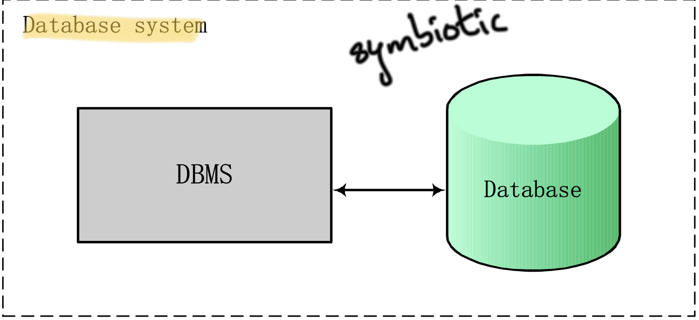
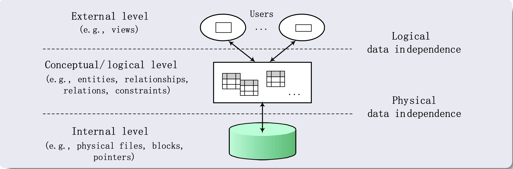
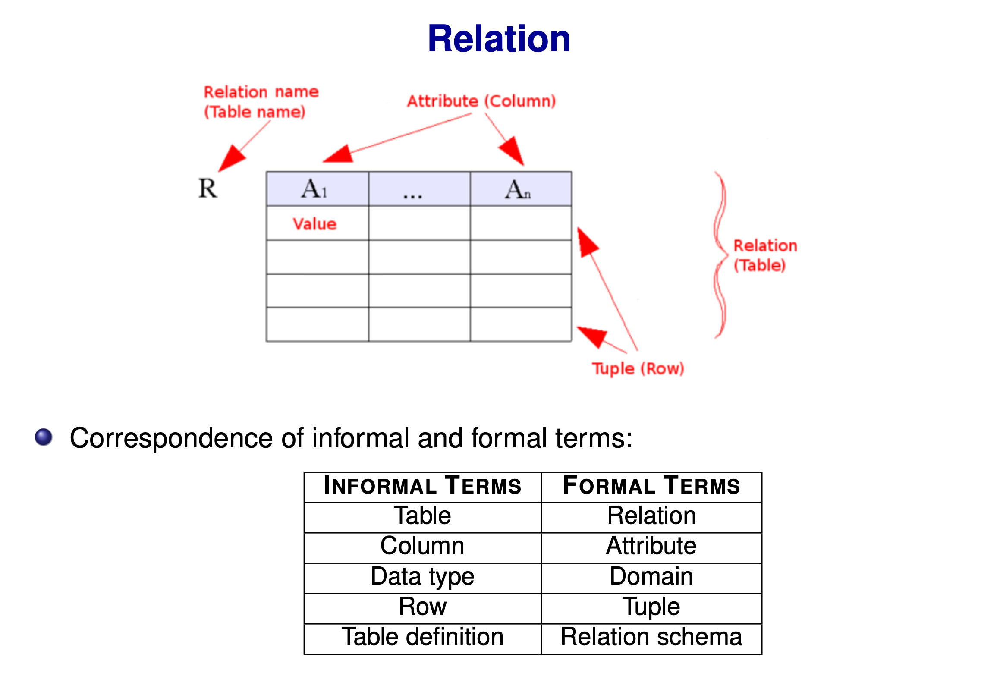
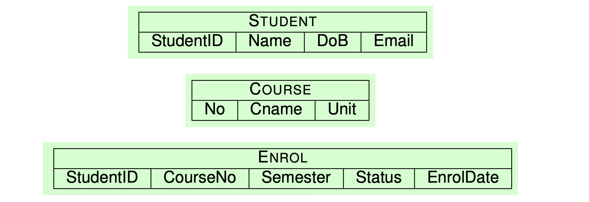
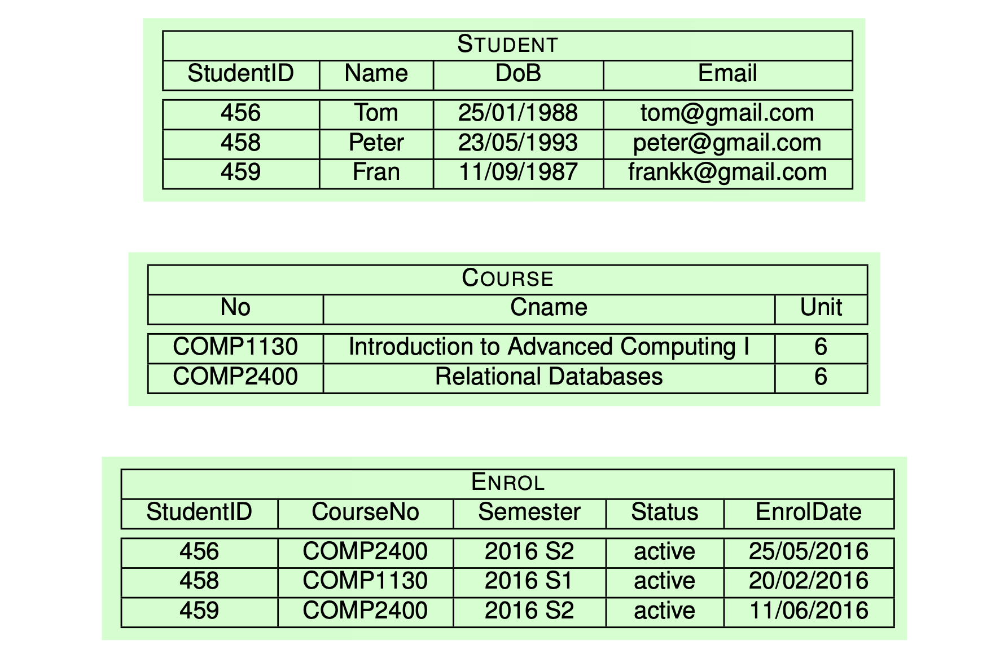

# Database Management System (DBMS)

A collection of programs that enables users to create and maintain a database, which is composed of tables (Relations) made up of columns and rows.

### 4 Main Processes
1. **Defining**
2. **Constructing**
3. **Manipulating**
4. **Sharing**

A **database system** = DBMS + database


<div style="text-align:center">
  
</div>

---

## Benefits of Database System

- Data redundancy
- Data integrity
- Data security
- Concurrent transactions
- Backup and recovery services
- Data independence

---

## Three-Level ANSI/SPARC Architecture

| Level | Example |
|-------|---------|
| **External** | `SELECT name FROM students;` |
| **Conceptual/Logical** | `CREATE TABLE students (...);` |
| **Internal** | How PostgreSQL stores that table on disk |





### Derived Principles: Data Independence

- **Logical data independence:** Change the conceptual/logical schemas without having to change external schemas or application programs.
  - *Example:* If adding or removing entities, external schemas that refer only to the remaining data should not be affected.

- **Physical data independence:** Change the internal schemas without having to change the conceptual/logical schemas.
  - *Example:* If physical files were reorganised, we should not have to change the conceptual/logical schemas.

### ANSI/SPARC Schema vs SQL Schema

ANSI/SPARC "schema" refers to a level of database description (external, conceptual, or internal), while SQL `SCHEMA` refers to a named namespace that groups database objects such as tables and views. In short, ANSI/SPARC schema is an **architectural concept**, whereas SQL schema is an **organizational container** inside the database.

---

## Relational Data Model

A database contains tables called **relations**.

<div style="text-align:center">
  
</div>

A **relation** (table) is a set of **tuples** (rows), which is composed of ordered **attributes** (columns).

Therefore, ordering of tuples (rows) is **not important**, whereas the ordering of attributes (columns) inside the tuple **is**.

### The Basics

**Attributes** are used to describe the properties of information. In the relational model, they usually refer to atomic data.

> *Example:* To capture the information of a person, we can use attributes like Name, Age, Gender, Address, and PhoneNumber.

**Domains** are the sets of all possible values for attributes.

> *Example:*
> - STRING = {A, B, CD, ...}
> - DATE = {01/01/2005, 03/07/1978, ...}
> - INT = {..., −1, 0, 1, 2, ...}

### Cartesian Product

Recall that the Cartesian product D₁ × ... × Dₙ is the set of all possible combinations of values from the sets D₁, ..., Dₙ.

> *Example:* Let D₁ = {book, pen}, D₂ = {1, 2}, and D₃ = {red}.
> Then D₁ × D₂ × D₃ = {(book,1,red), (book,2,red), (pen,1,red), (pen,2,red)}

### Relation Schema

A **relation schema** consists of a relation name and a list of attributes.

> *Example:* R(A₁, A₂, ..., Aₙ)
> 
> R(A₁ : dom(A₁), ..., Aₙ : dom(Aₙ)),
> 
> where A₁, ..., Aₙ are attributes of R and dom(Aᵢ) is the domain of Aᵢ.
> - ENROL(StudentID: INT, CourseNo: STRING, Semester: STRING,
Status: STRING, EnrolData: DATE).

---

### Relation as a Set of Tuples

A relation r (R) is a set of tuples:

  r (R) ⊆ dom(A₁) × ... × dom(Aₙ)

**Example:** The previous example has the following relation:

  r (ENROL) ⊆ INT × STRING × STRING × STRING × DATE

---

### Tuples
A tuple in R is a list t of values, i.e.,t ∈ dom(A₁) × ... × dom(Aₙ)

(456, COMP2400, 2016 S2, active, 25/05/2016) ∈ INT × STRING × STRING × STRING × DATE

---

## Relational Database Schema and State

- Relational database schema S: set of relation schemas S = {R₁, ..., Rₘ} plus set of integrity constraints IC
- Relational database state of S: set of relations, one per schema in S, all satisfying IC

<div style="display:flex; gap:16px; justify-content:center; align-items:flex-start;">
  
  
</div>

---

## Main Types of Constraints

- Domain constraints (which is data type)
- Key constraints
- Entity integrity constraints
- Referential integrity constraints

---

## Key Constraints

- Superkey: subset of attributes of `R` that uniquely identifies each tuple in `r(R)`
- Candidate key: minimal superkey; removing any attribute means it no longer uniquely identifies tuples
- Primary key: one chosen candidate key
- Every candidate key is a superkey
- A superkey may contain redundant attributes; a candidate key cannot
- Since duplicate tuples are not allowed, the set of all attributes in a relation is always a superkey, but usually not a candidate key

### NULL Values in Keys

- Candidate key attributes may still be `NULL` unless that candidate key is chosen as the primary key
- Primary key attributes cannot be `NULL`
- Domain constraints can also force other attributes to be non-`NULL`

### Example 1: `STUDENT(StudentID, Name, DoB, Email)`

| Key Type | Example |
|---|---|
| Superkeys | `{StudentID}`, `{Email}`, `{StudentID, Name}`, `{StudentID, Email}` |
| Candidate keys | `{StudentID}`, `{Email}` |
| Primary key | `{StudentID}` or `{Email}` |

### Example 2: `ENROL(StudentID, CourseNo, Semester, Status)`

- `{StudentID, CourseNo, Semester}` is a superkey
- Any superset containing all three attributes is also a superkey
- `{StudentID, CourseNo, Semester}` is the only candidate key
- Primary key: `{StudentID, CourseNo, Semester}`

---

## Entity Integrity Constraints

- The entity integrity constraint states that no primary key value can be `NULL`.
- Primary key implies the entity integrity constraint.
- `NULL` means an unknown or inapplicable value.
- No primary key value can be `NULL` because primary keys identify tuples.
- Non-primary-key attributes may still allow `NULL` unless otherwise constrained.

---

## Referential Integrity Constraints

- A referential integrity constraint specifies a reference between two relations.
- The value of an attribute, or list of attributes, in each tuple of one relation, if not `NULL`, must match a value or list of values in some tuple of another relation.
- `t[A]`: value of attribute `A` in tuple `t`
- Example: if `t = (459, Fran, 11/09/1987, frankk@gmail.com)`, then `t[Name] = Fran` and `t[DoB] = 11/09/1987`
- Referential integrity specifies a reference between two relations
- If `R2` has primary key `{B₁, ..., Bₙ}`, then a foreign key in `R1` is `[A₁, ..., Aₙ]` referencing `R2[B₁, ..., Bₙ]`
- Rule: for every tuple `t` in `r(R1)`, there must exist a tuple `t'` in `r(R2)` such that `t[Aᵢ] = t'[Bᵢ]` for `i = 1, ..., n`
- `R1` = referencing relation
- `R2` = referenced relation

### One Example Covering All 4 Constraints

Relations:

- `STUDENT(StudentID, Name, Email)` with primary key `StudentID`
- `COURSE(CourseNo, Title)` with primary key `CourseNo`
- `ENROL(StudentID, CourseNo, Semester, Mark)` with primary key `{StudentID, CourseNo, Semester}`

Valid example:

`STUDENT`

| StudentID | Name | Email |
|---|---|---|
| 456 | Tom | tom@gmail.com |
| 458 | Peter | peter@gmail.com |

`COURSE`

| CourseNo | Title |
|---|---|
| COMP2400 | Database Systems |
| COMP6240 | Data Management |

`ENROL`

| StudentID | CourseNo | Semester | Mark |
|---|---|---|---|
| 456 | COMP2400 | 2016 S2 | 85 |

What each constraint means here:

- Domain constraint: `Mark` must be an integer, so `Mark = "HD"` is invalid
- Key constraint: another `ENROL(456, COMP2400, 2016 S2, 90)` is invalid because the primary key already exists
- Entity integrity: `ENROL(NULL, COMP2400, 2016 S2, 85)` is invalid because a primary key attribute cannot be `NULL`
- Referential integrity: `ENROL(456, COMP9999, 2016 S2, 85)` is invalid because `COMP9999` does not exist in `COURSE`

---

## Constraint Violations by Operations

- Database state can change through three operations: `INSERT`, `DELETE`, and `UPDATE`.
- These operations must not violate integrity constraints.

| Operation | What it does | Constraints that may be violated | Example |
|---|---|---|---|
| Insert | Adds new tuple(s) | Domain, Key, Entity integrity, Referential integrity | Insert text into an integer column; insert duplicate primary key; insert `NULL` primary key; insert foreign key value not found in parent table |
| Delete | Removes tuple(s) | Mainly Referential integrity | Deleting `STUDENT(456)` while `ENROL` still references student `456` creates orphan tuples |
| Update | Changes attribute values in existing tuples | Domain, Key, Entity integrity, Referential integrity | Change data type incorrectly; change primary key to duplicate or `NULL`; change `COURSE.No` from `COMP2400` while `ENROL` still references it |

### Quick Notes

- `INSERT` can violate all four main constraint types.
- `DELETE` mainly risks referential integrity when other relations still reference the deleted tuple.
- `UPDATE` can violate different constraints depending on which attribute is changed.


# SQL

- SQL provides an interface to relational database systems.
- Main SQL categories:
  - DDL: Data Definition Language. Common commands: `CREATE`, `ALTER`, `DROP`, `TRUNCATE`
  - DML: Data Manipulation Language. Common commands: `SELECT`, `INSERT`, `UPDATE`, `DELETE`
  - DCL: Data Control Language. Common commands: `GRANT`, `REVOKE`
  - TCL: Transaction Control Language. Common commands: `COMMIT`, `ROLLBACK`, `SAVEPOINT`
- Relational model is based on sets, so duplicate tuples are not allowed.
- SQL is based on multisets (bags), so duplicate rows are allowed by default.
- Constraints do not automatically remove all duplicates.
- Duplicate values are restricted only when a key, primary key, or `UNIQUE` constraint is defined.
- So SQL can allow duplicate rows, but specific constraints can prevent duplicates on selected attributes.

## CREATE TABLE

- `CREATE TABLE` is used to create a new relation schema.
- It specifies the table name, attributes, data types, and optional constraints.

General syntax:

```sql
CREATE TABLE table_name (
    attribute_name data_type [attribute_constraint],
    ...,
    attribute_name data_type [attribute_constraint],
    [table_constraint]
);
```

  Example:

  ```sql
  CREATE TABLE Student (
    StudentID INT,
    Name VARCHAR(50),
    DoB DATE,
    Email VARCHAR(100)
  );
  ```

## Attribute Data Types

| Category | Type | Meaning | Example |
|---|---|---|---|
| Numeric | `INT`, `SMALLINT` | Integer numbers of different sizes | `25`, `1024` |
| Numeric | `FLOAT`, `REAL`, `DOUBLE PRECISION` | Floating-point numbers of different precision | `3.14`, `98.765` |
| Numeric | `NUMERIC(i,j)`, `DECIMAL(i,j)` | Fixed-point numbers where `i` = total digits and `j` = digits after decimal | `NUMERIC(5,2)` -> `123.45` |
| String | `CHAR(n)` | Fixed-length character string | `CHAR(3)` -> `'ABC'` |
| String | `VARCHAR(n)` | Variable-length character string, up to `n` characters | `VARCHAR(50)` -> `'Tom'` |
| String | `BIT(n)` | Fixed-length bit string | `BIT(4)` -> `B'1010'` |
| String | `BIT VARYING(n)` | Variable-length bit string, up to `n` bits | `BIT VARYING(8)` -> `B'101'` |
| Date and Time | `DATE` | Date values: year, month, day | `DATE '2026-03-19'` |
| Date and Time | `TIME` | Time values: hour, minute, second | `TIME '14:30:00'` |
| Date and Time | `TIMESTAMP` | Date and time, optionally with time zone | `TIMESTAMP '2026-03-19 14:30:00'` |
| Date and Time | `INTERVAL` | Relative time value used to add or subtract from date/time/timestamp | `INTERVAL '7 days'` |
| Other | `BOOLEAN` | `TRUE` or `FALSE` | `TRUE` |

## CREATE DOMAIN

- `CREATE DOMAIN` creates a domain, which is essentially a specific data type.

Examples:

| Domain Name | Base Type | Example Purpose | Example |
|---|---|---|---|
| `ssn_type` | `CHAR(9)` | Store fixed-length SSN values | `CREATE DOMAIN ssn_type AS CHAR(9);` |
| `email_type` | `VARCHAR(100)` | Store email addresses | `CREATE DOMAIN email_type AS VARCHAR(100);` |
| `mark_type` | `INT` | Store marks with constraints | `CREATE DOMAIN mark_type AS INT CHECK (VALUE >= 0 AND VALUE <= 100);` |

Syntax:

```sql
CREATE DOMAIN domain_name AS data_type
[default expression] [constraint, ..., constraint];
```

Example:

```sql
CREATE DOMAIN ssn_type AS CHAR(9);
```

## Attribute Constraints

| Constraint | Meaning | Example |
|---|---|---|
| `NOT NULL` | `NULL` is not allowed for the attribute | `Name VARCHAR(50) NOT NULL` |
| `DEFAULT` | Sets a default value for the attribute | `Status VARCHAR(20) DEFAULT 'active'` |
| `CHECK` | Restricts values allowed for the attribute | `Mark INT CHECK (Mark >= 0 AND Mark <= 100)` |
| `UNIQUE` | Ensures unique values for an attribute or set of attributes | `Email VARCHAR(100) UNIQUE` |
| `PRIMARY KEY` | Uniquely identifies each tuple in a table | `StudentID INT PRIMARY KEY` |
| `FOREIGN KEY` | Enforces referential integrity between tables | `FOREIGN KEY (CourseNo) REFERENCES Course(No)` |
| `INDEX` | Speeds up access to table rows | `CREATE INDEX idx_student_name ON Student(Name);` |

### More on INDEX

- `INDEX` is mainly a performance feature rather than a logical integrity constraint.
- It helps the DBMS find rows faster for queries using `WHERE`, `JOIN`, `ORDER BY`, or `GROUP BY`.

| Index Type | Purpose | Duplicates Allowed? | Example |
|---|---|---|---|
| Normal index | Faster lookup on selected columns | Yes | `CREATE INDEX index1 ON Customer(Name, DOB);` |
| Unique index | Faster lookup and uniqueness enforcement | No | `CREATE UNIQUE INDEX index2 ON Customer(Phone);` |
| Primary key index | Usually created automatically for the primary key | No | `PRIMARY KEY(CustomerID)` |

Example use:

```sql
CREATE TABLE Customer (
  CustomerID INT NOT NULL,
  Name VARCHAR(50) NOT NULL,
  DOB DATE NOT NULL,
  Address VARCHAR(80),
  Phone INT CHECK (Phone > 0),
  PRIMARY KEY (CustomerID)
);

CREATE INDEX index1 ON Customer (Name, DOB);
CREATE UNIQUE INDEX index2 ON Customer (Phone);
```

- `index1` speeds up searches by `Name` and `DOB`.
- `index2` speeds up searches by `Phone` and also prevents duplicate phone values.
- Indexes improve read speed but can slow `INSERT`, `UPDATE`, and `DELETE` because the index must also be updated.

## ALTER TABLE and DROP TABLE

- `ALTER TABLE` modifies an existing table schema.
- `DROP TABLE` removes an existing table schema from the database.

### ALTER TABLE Summary

| Operation | Meaning | Example |
|---|---|---|
| Rename table | Change the table name | `ALTER TABLE Customer RENAME TO Client;` |
| Add column | Add a new attribute | `ALTER TABLE Customer ADD Email VARCHAR(100);` |
| Drop column | Remove an attribute | `ALTER TABLE Customer DROP COLUMN Email;` |
| Change column definition | Modify column properties | `ALTER TABLE Customer ALTER COLUMN Address SET NOT NULL;` |
| Add `UNIQUE` constraint | Add a uniqueness constraint | `ALTER TABLE Customer ADD UNIQUE (Phone);` |
| Add `CHECK` constraint | Add a check constraint | `ALTER TABLE Customer ADD CONSTRAINT positive_id CHECK (CustomerID > 0);` |
| Add foreign key | Add a referential integrity constraint | `ALTER TABLE Enrol ADD FOREIGN KEY (StudentID) REFERENCES Student(StudentID);` |
| Drop constraint | Remove a constraint | `ALTER TABLE Customer DROP CONSTRAINT positive_id;` |

### Why Some Syntax Uses `ADD` and Others Use `SET`

- Use `ADD` when adding something new to the table:
  - a column
  - a table constraint
- Use `DROP` when removing something:
  - a column
  - a constraint
- Use `ALTER COLUMN ... SET ...` when changing an existing column property:
  - `SET NOT NULL`
  - `SET DEFAULT`
  - sometimes data type changes, depending on SQL dialect

Note:

- `NOT NULL` is treated as a column property in PostgreSQL, so it is removed with `ALTER COLUMN ... DROP NOT NULL` and does not need a constraint name.
- Constraints such as `UNIQUE`, `CHECK`, `FOREIGN KEY`, and `PRIMARY KEY` are usually removed with `DROP CONSTRAINT constraint_name`.

### DROP TABLE

| Task | SQL |
|---|---|
| Drop a table | `DROP TABLE Enrol;` |
| Drop a table only if it exists | `DROP TABLE IF EXISTS Customer;` |

## Data Manipulation Language: INSERT, UPDATE, DELETE

### INSERT

- `INSERT` adds new tuples into a relation.

Common example relations:

`Student`

| StudentID | Name | DoB | Email |
|---|---|---|---|
| 456 | Tom | 1988-01-25 | tom@gmail.com |
| 458 | Peter | 1991-02-20 | peter@hotmail.com |
| 459 | Fran | 1987-09-11 | frankk@gmail.com |

`Enrol`

| StudentID | CourseNo | Semester | Status |
|---|---|---|---|
| 456 | COMP2400 | 2016 S2 | active |
| 458 | COMP1130 | 2016 S1 | active |

Syntax:

```sql
INSERT INTO table_name [(attribute_name, ..., attribute_name)]
VALUES (value, ..., value), ..., (value, ..., value);
```

- Values can be inserted with or without explicitly listing attributes.
- The order of values must match the listed attributes, or the table's column order if no attributes are listed.
- DBMS will reject inserts that violate constraints.

Examples of violations:

- Primary key violation: inserting another tuple with `StudentID = 456` into `Student` is not allowed.
- Foreign key violation: inserting `StudentID = 460` into `Enrol` is not allowed if `460` does not exist in `Student`.

### UPDATE

- `UPDATE` modifies attribute values of selected tuples.

Syntax:

```sql
UPDATE table_name
SET attribute_name = value, ..., attribute_name = value
[WHERE selection_condition];
```

- Without `WHERE`, all tuples in the table are updated.

Example:

```sql
UPDATE Student
SET Name = 'Tom Lee', Email = 'tom.lee@yahoo.com'
WHERE StudentID = 456;
```

### DELETE

- `DELETE` removes tuples from a relation.

Syntax:

```sql
DELETE FROM table_name
[WHERE selection_condition];
```

- Without `WHERE`, all tuples in the table are deleted.
- Deletes may be rejected if they violate referential integrity.

Examples:

```sql
DELETE FROM Student WHERE StudentID = 456;
```

```sql
DELETE FROM Student;
```

- `DELETE FROM Student;` removes all rows, but the table still exists.
- `DROP TABLE Student;` removes the table itself.

## Referential Actions

- Referential actions define what happens when a referenced row is updated or deleted through a foreign key.

| Action | Meaning |
|---|---|
| `NO ACTION` | Reject delete/update if referenced rows still exist |
| `CASCADE` | Delete/update referencing rows automatically |
| `SET NULL` | Set referencing foreign-key values to `NULL` |
| `SET DEFAULT` | Set referencing foreign-key values to their default value |

Example foreign key:

```sql
FOREIGN KEY (StudentID) REFERENCES Student(StudentID) ON DELETE NO ACTION
```

- With `ON DELETE NO ACTION`, deleting a student who is still referenced in `Enrol` causes an error.

```sql
FOREIGN KEY (StudentID) REFERENCES Student(StudentID) ON DELETE CASCADE
```

- With `ON DELETE CASCADE`, deleting a student also deletes all related rows in `Enrol`.

```sql
FOREIGN KEY (StudentID) REFERENCES Student(StudentID) ON DELETE SET NULL
```

- With `ON DELETE SET NULL`, deleting a student keeps the `Enrol` row but changes `StudentID` in that row to `NULL`.

## Simple SQL Queries

- `SELECT` is used to retrieve data from a database.
- Basic form:

```sql
SELECT attribute_list
FROM table_list
[WHERE condition]
[GROUP BY attribute_list [HAVING group_condition]]
[ORDER BY attribute_list];
```

Notes:

- Only `SELECT` and `FROM` are mandatory.
- `*` means all attributes.
- Attribute names may be qualified with the table name, especially when names are not unique.
- Tables and attributes can be given aliases.
- `DISTINCT` removes duplicate rows from the query result.

Execution order:

1. `FROM`
2. `WHERE`
3. `GROUP BY`
4. `HAVING`
5. `SELECT`
6. `DISTINCT`
7. `ORDER BY`

Memory aid:

- SQL is written as `SELECT ... FROM ... WHERE ...`, but logically processed as `FROM -> WHERE -> GROUP BY -> HAVING -> SELECT -> DISTINCT -> ORDER BY`.

## GROUP BY and HAVING

- `GROUP BY attribute_list` groups rows by each distinct value combination in the listed attributes.
- Aggregate functions summarize each group into a single value.

Common aggregate functions:

| Function | Meaning |
|---|---|
| `COUNT(...)` | Number of values or rows |
| `AVG(...)` | Average value |
| `MIN(...)` | Minimum value |
| `MAX(...)` | Maximum value |
| `SUM(...)` | Sum of values |

- `HAVING` applies conditions to groups after `GROUP BY`.
- `WHERE` filters rows before grouping; `HAVING` filters groups after grouping.
- Use `GROUP BY` when you want one result per category or per value and you select a non-aggregated column.
- In general, all `non-aggregated` columns in `SELECT` should also appear in `GROUP BY`.

Simple example:

```sql
SELECT CourseNo, COUNT(*)
FROM Enrol
GROUP BY CourseNo;
```

- `CourseNo` is non-aggregated, so it must appear in `GROUP BY`.
- `COUNT(*)` is aggregated, so it does not need to appear in `GROUP BY`.

Example with two grouping attributes:

```sql
SELECT CourseNo, Semester, COUNT(*)
FROM Enrol
GROUP BY CourseNo, Semester;
```

- `CourseNo` and `Semester` are both non-aggregated, so both must appear in `GROUP BY`.

Examples:

Count, sum, and minimum from `Course`:

```sql
SELECT COUNT(*), SUM(Unit), MIN(Unit)
FROM Course;
```

Example result:

| COUNT | SUM | MIN |
|---|---|---|
| 3 | 16 | 4 |

Count students enrolled in each course in Semester 2 2016:

```sql
SELECT e.CourseNo, COUNT(*) AS NumberOfStudents
FROM Enrol e
WHERE e.Semester = '2016 S2'
GROUP BY e.CourseNo;
```

Keep only groups with at least 120 students:

```sql
SELECT e.CourseNo, COUNT(*) AS NumberOfStudents
FROM Enrol e
WHERE e.Semester = '2016 S2'
GROUP BY e.CourseNo
HAVING COUNT(*) >= 120;
```

